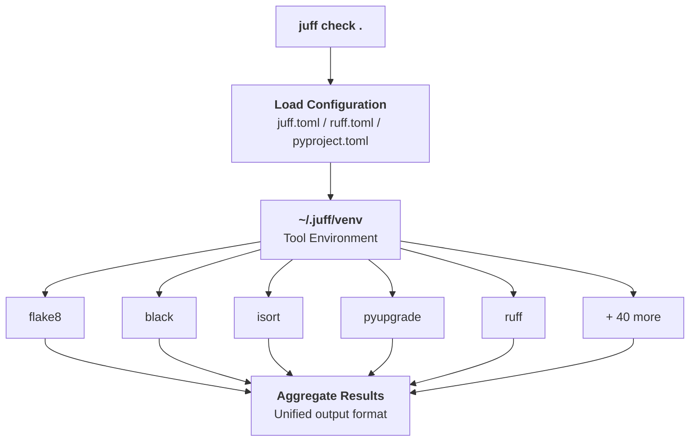

# Juff

[](https://github.com/marsninja/juff/actions/workflows/test.yml)
[](https://badge.fury.io/py/juff)
[](https://www.python.org/downloads/)
[](https://opensource.org/licenses/MIT)
[](https://github.com/psf/black)

**A faithful Python-first drop-in replacement for [ruff](https://github.com/astral-sh/ruff).**

Juff brings together the original Python linting and formatting tools under a unified, ruff-compatible interface. Instead of reimplementing these tools, Juff orchestrates them directly—honoring the original authors while providing the convenience of a single command.

---

## Table of Contents

- [Philosophy](#philosophy)
- [Features](#features)
- [Installation](#installation)
- [Quick Start](#quick-start)
- [Configuration](#configuration)
- [Rule Codes](#rule-codes)
- [Commands](#commands)
- [Pre-commit Integration](#pre-commit-integration)
- [CI/CD Integration](#cicd-integration)
- [Migrating from Ruff](#migrating-from-ruff)
- [How It Works](#how-it-works)
- [Comparison with Ruff](#comparison-with-ruff)
- [Troubleshooting](#troubleshooting)
- [FAQ](#faq)
- [Development](#development)
- [Contributing](#contributing)
- [License](#license)
- [Credits](#credits)

---

## Philosophy

Juff is built on a simple principle: **use the original tools, not reimplementations**.

The Python ecosystem has mature, battle-tested linting and formatting tools created by visionary developers. Rather than rewriting their work, Juff orchestrates these tools directly:

| Tool | Purpose | Original Author(s) |
|------|---------|-------------------|
| **flake8** | Linting framework | Tarek Ziadé & PyCQA |
| **black** | Code formatting | Łukasz Langa |
| **isort** | Import sorting | Timothy Crosley |
| **pyupgrade** | Syntax upgrades | Anthony Sottile |
| **autoflake** | Dead code removal | PyCQA |
| **pylint** | Advanced linting | Logilab & PyCQA |
| **40+ flake8 plugins** | Extended linting | Community |

Juff manages these tools in an isolated virtual environment (`~/.juff/venv`), keeping your project dependencies clean while providing seamless access to the full power of Python's linting ecosystem.

---

## Features

- **Ruff-compatible CLI** — Drop-in replacement for most ruff commands
- **Ruff-compatible configuration** — Use your existing `ruff.toml` or `juff.toml`
- **Full flake8 plugin support** — Access 40+ plugins out of the box
- **Isolated tool environment** — Tools installed in `~/.juff/venv`, not your project
- **Auto-fixing** — Automatic code fixes via autoflake, pyupgrade, and black
- **Per-file ignores** — Fine-grained control over rule application
- **Zero runtime dependencies** — Juff itself has no dependencies

---

## Installation

### From PyPI (Recommended)

```bash
pip install juff
```

### From Source

```bash
git clone https://github.com/marsninja/juff.git
cd juff
pip install .
```

### Verify Installation

```bash
juff version
```

On first run, Juff will automatically initialize its tool environment. This downloads and installs all required tools (~50MB) to `~/.juff/venv`.

---

## Quick Start

```bash
# Lint your code
juff check .

# Lint and auto-fix issues
juff check --fix .

# Format your code
juff format .

# Check formatting without changes
juff format --check .

# See what would change
juff format --diff .
```

---

## Configuration

Juff reads configuration from (in order of precedence):

1. `juff.toml` in the current directory
2. `.juff.toml` in the current directory
3. `[tool.juff]` section in `pyproject.toml`
4. `ruff.toml` in the current directory (for compatibility)
5. `[tool.ruff]` section in `pyproject.toml`

### Example Configuration

```toml
# juff.toml
target-version = "py311"
line-length = 88

# Exclude patterns (glob syntax)
exclude = [
    "vendor/",
    "**/migrations/*",
    "*.generated.py",
]

[lint]
# Rules to enable (see Rule Codes section)
select = [
    "E",      # pycodestyle errors
    "F",      # pyflakes
    "W",      # pycodestyle warnings
    "B",      # flake8-bugbear
    "I",      # isort
    "UP",     # pyupgrade
    "N",      # pep8-naming
    "S",      # flake8-bandit (security)
    "C4",     # flake8-comprehensions
    "SIM",    # flake8-simplify
    "ANN",    # flake8-annotations
]

# Rules to ignore globally
ignore = ["E501"]  # Line too long (let black handle it)

# Auto-fixable rules
fixable = ["ALL"]

# Per-file rule ignores
[lint.per-file-ignores]
"**/tests/*" = ["S101", "ANN"]  # Allow assert and skip annotations in tests
"**/fixtures/*" = ["ALL"]       # Ignore all rules in fixtures
"conftest.py" = ["E501"]        # Allow long lines in conftest

[lint.isort]
known-first-party = ["myproject", "mylib"]
known-third-party = ["requests", "flask"]

[lint.flake8-annotations]
suppress-none-returning = true
```

### Configuration Reference

#### Top-Level Options

| Option | Type | Default | Description |
|--------|------|---------|-------------|
| `target-version` | string | `"py311"` | Target Python version (`py38`, `py39`, `py310`, `py311`, `py312`) |
| `line-length` | integer | `88` | Maximum line length |
| `exclude` | array | `[]` | Glob patterns for files/directories to exclude |
| `include` | array | `["*.py"]` | Glob patterns for files to include |

#### Lint Options (`[lint]`)

| Option | Type | Default | Description |
|--------|------|---------|-------------|
| `select` | array | `["E", "F", "W"]` | Rule codes to enable |
| `ignore` | array | `[]` | Rule codes to ignore |
| `fixable` | array | `["ALL"]` | Rules that can be auto-fixed |
| `unfixable` | array | `[]` | Rules that should not be auto-fixed |

#### Per-File Ignores (`[lint.per-file-ignores]`)

```toml
[lint.per-file-ignores]
"pattern" = ["RULE1", "RULE2"]
```

Supports glob patterns including `**` for recursive matching.

#### Isort Options (`[lint.isort]`)

| Option | Type | Default | Description |
|--------|------|---------|-------------|
| `known-first-party` | array | `[]` | Modules to treat as first-party |
| `known-third-party` | array | `[]` | Modules to treat as third-party |

#### Flake8-Annotations Options (`[lint.flake8-annotations]`)

| Option | Type | Default | Description |
|--------|------|---------|-------------|
| `suppress-none-returning` | boolean | `false` | Don't require `-> None` for functions |

---

## Rule Codes

Juff supports rule codes compatible with ruff, mapped to their original tools:

### Core Rules

| Prefix | Tool | Description |
|--------|------|-------------|
| `E` | pycodestyle | Style errors |
| `W` | pycodestyle | Style warnings |
| `F` | pyflakes | Logical errors, undefined names, unused imports |
| `C90` | mccabe | Cyclomatic complexity |

### Extended Rules (flake8 plugins)

| Prefix | Plugin | Description |
|--------|--------|-------------|
| `ANN` | flake8-annotations | Type annotation issues |
| `A` | flake8-builtins | Built-in shadowing |
| `ARG` | flake8-unused-arguments | Unused function arguments |
| `ASYNC` | flake8-async | Async/await issues |
| `B` | flake8-bugbear | Likely bugs and design issues |
| `BLE` | flake8-blind-except | Blind except statements |
| `C4` | flake8-comprehensions | Unnecessary comprehensions |
| `COM` | flake8-commas | Trailing comma issues |
| `D` | flake8-docstrings | Docstring style (pydocstyle) |
| `DTZ` | flake8-datetimez | Naive datetime usage |
| `EM` | flake8-errmsg | Error message formatting |
| `ERA` | flake8-eradicate | Commented-out code |
| `EXE` | flake8-executable | Executable issues |
| `FA` | flake8-future-annotations | Future annotations |
| `FBT` | flake8-boolean-trap | Boolean trap anti-pattern |
| `G` | flake8-logging-format | Logging format issues |
| `INP` | flake8-no-pep420 | Missing `__init__.py` |
| `INT` | flake8-gettext | i18n/gettext issues |
| `ISC` | flake8-implicit-str-concat | Implicit string concatenation |
| `N` | pep8-naming | Naming conventions |
| `PIE` | flake8-pie | Misc. lints |
| `PT` | flake8-pytest-style | Pytest style issues |
| `PTH` | flake8-use-pathlib | Pathlib suggestions |
| `Q` | flake8-quotes | Quote style consistency |
| `RET` | flake8-return | Return statement issues |
| `RSE` | flake8-raise | Raise statement issues |
| `S` | flake8-bandit | Security issues |
| `SIM` | flake8-simplify | Code simplification |
| `SLF` | flake8-self | Private member access |
| `T10` | flake8-debugger | Debugger statements |
| `T20` | flake8-print | Print statements |
| `TCH` | flake8-type-checking | Type-checking imports |
| `TID` | flake8-tidy-imports | Import tidiness |
| `TRY` | tryceratops | Exception handling |

### Formatting & Upgrade Rules

| Prefix | Tool | Description |
|--------|------|-------------|
| `I` | isort | Import sorting |
| `UP` | pyupgrade | Python syntax upgrades |

---

## Commands

### `juff check [PATHS...]`

Run linting checks on Python files.

```bash
juff check .                      # Check current directory
juff check src/ tests/            # Check specific paths
juff check --fix .                # Auto-fix issues
juff check --select E,F .         # Only specific rules
juff check --ignore E501,W503 .   # Ignore specific rules
juff check --config custom.toml . # Use custom config
```

**Options:**
| Option | Description |
|--------|-------------|
| `--fix` | Auto-fix fixable issues |
| `--select RULES` | Comma-separated rules to enable |
| `--ignore RULES` | Comma-separated rules to ignore |
| `--config PATH` | Path to configuration file |
| `--quiet` | Suppress non-error output |

### `juff format [PATHS...]`

Format Python files using black and isort.

```bash
juff format .                     # Format current directory
juff format --check .             # Check without changes
juff format --diff .              # Show what would change
juff format src/ tests/           # Format specific paths
```

**Options:**
| Option | Description |
|--------|-------------|
| `--check` | Check formatting without applying |
| `--diff` | Show diff of changes |
| `--config PATH` | Path to configuration file |

### `juff init`

Initialize or reinitialize the Juff tool environment.

```bash
juff init                         # Initialize if needed
juff init --force                 # Force reinstall all tools
```

### `juff update`

Update all tools to their latest versions.

```bash
juff update
```

### `juff clean`

Remove the Juff virtual environment.

```bash
juff clean                        # Remove ~/.juff/venv
```

### `juff version`

Display version information.

```bash
juff version                      # Show juff and key tools
juff version --verbose            # Show all installed packages
```

### `juff rule <CODE>`

Show information about a specific rule.

```bash
juff rule E501                    # Info about line length
juff rule F401                    # Info about unused imports
juff rule B006                    # Info about mutable defaults
```

---

## Pre-commit Integration

Add Juff to your `.pre-commit-config.yaml`:

```yaml
repos:
  - repo: https://github.com/marsninja/juff
    rev: v0.1.0  # Use the latest version
    hooks:
      - id: juff-check        # Lint only
      - id: juff-format       # Format files
```

Available hook IDs:
- `juff-check` — Lint Python files
- `juff-check-fix` — Lint and auto-fix Python files
- `juff-format` — Format Python files (black + isort)
- `juff-format-check` — Check formatting without modifying files

Or use local installation:

```yaml
repos:
  - repo: local
    hooks:
      - id: juff-check
        name: juff check
        entry: juff check --fix
        language: system
        types: [python]
        pass_filenames: true

      - id: juff-format
        name: juff format
        entry: juff format
        language: system
        types: [python]
        pass_filenames: true
```

---

## CI/CD Integration

### GitHub Actions

```yaml
name: Lint

on: [push, pull_request]

jobs:
  lint:
    runs-on: ubuntu-latest
    steps:
      - uses: actions/checkout@v5

      - name: Set up Python
        uses: actions/setup-python@v5
        with:
          python-version: '3.12'

      - name: Cache Juff venv
        uses: actions/cache@v4
        with:
          path: ~/.juff
          key: juff-${{ runner.os }}-${{ hashFiles('juff.toml') }}

      - name: Install Juff
        run: pip install juff

      - name: Run linting
        run: juff check .

      - name: Check formatting
        run: juff format --check .
```

### GitLab CI

```yaml
lint:
  image: python:3.12
  cache:
    paths:
      - ~/.juff/
  script:
    - pip install juff
    - juff check .
    - juff format --check .
```

---

## Migrating from Ruff

Juff is designed to be a drop-in replacement for ruff. In most cases:

1. **Install Juff:**
   ```bash
   pip install juff
   ```

2. **Rename your config (optional):**
   ```bash
   mv ruff.toml juff.toml  # Optional: Juff reads ruff.toml too
   ```

3. **Replace commands:**
   ```bash
   # Before
   ruff check .
   ruff format .

   # After
   juff check .
   juff format .
   ```

### Compatibility Notes

| Feature | Juff Support |
|---------|--------------|
| `ruff check` | Full support |
| `ruff format` | Full support |
| `ruff.toml` config | Full support |
| Per-file ignores | Full support |
| `--fix` flag | Full support |
| `--select/--ignore` | Full support |
| `ruff server` (LSP) | Not supported |
| `ruff-lsp` | Not supported |

### Rule Differences

Most rules behave identically since Juff uses the original tools. However:

- **Ruff-only rules** (e.g., `RUF`, `AIR`, `FAST`, `NPY`) are handled by ruff itself when selected
- Flake8 plugins may have slightly different behavior than ruff's reimplementations
- Error messages and line numbers come directly from the underlying tools

#### Ruff-Only Rule Prefixes

The following rule prefixes have no Python tool equivalent and are delegated to ruff:

| Prefix | Name | Description |
|--------|------|-------------|
| `RUF` | Ruff | Ruff-specific rules |
| `AIR` | Airflow | Apache Airflow rules |
| `FAST` | FastAPI | FastAPI rules |
| `NPY` | NumPy | NumPy-specific rules |
| `PGH` | pygrep-hooks | Grep-based checks |

---

## How It Works



1. **Configuration Loading**: Juff reads your config file and maps settings to tool-specific arguments.

2. **Tool Environment**: On first run, Juff creates `~/.juff/venv` and installs all required tools.

3. **Orchestration**: Based on selected rules, Juff runs the appropriate tools in the correct order.

4. **Result Aggregation**: Output from all tools is collected and presented in a unified format.

---

## Comparison with Ruff

| Aspect | Juff | Ruff |
|--------|------|------|
| **Implementation** | Orchestrates original tools | Rust reimplementation |
| **Speed** | Standard Python speed | 10-100x faster |
| **Accuracy** | 100% original tool behavior | Slight differences possible |
| **Plugin support** | All flake8 plugins | Limited subset |
| **Memory** | Higher (multiple processes) | Lower |
| **Binary size** | Requires Python + tools | Single ~20MB binary |
| **Offline use** | Needs initial download | Self-contained |
| **LSP support** | No | Yes |

### When to Use Juff

- You need **exact compatibility** with flake8/black/isort behavior
- You rely on **flake8 plugins** not supported by ruff
- You want to **support original tool authors**
- You prefer **Python-native** tooling
- You're in an environment where **Rust binaries** are problematic

### When to Use Ruff

- **Speed** is critical (very large codebases)
- You need **LSP/editor integration**
- You want a **single binary** with no dependencies
- You don't need unsupported flake8 plugins

---

## Troubleshooting

### Juff is slow on first run

The first run downloads and installs all tools (~50MB). Subsequent runs use the cached environment.

```bash
# Pre-initialize the environment
juff init
```

### Tools not found

If you see "tool not found" errors, reinitialize:

```bash
juff clean
juff init
```

### Configuration not being read

Check config file location and syntax:

```bash
# Juff searches in this order:
# 1. juff.toml
# 2. .juff.toml
# 3. pyproject.toml [tool.juff]
# 4. ruff.toml
# 5. pyproject.toml [tool.ruff]
```

### Different results than ruff

This is expected for rules that ruff has reimplemented differently. Juff uses the original tools, which may have subtle behavioral differences.

### Permission errors on ~/.juff

Ensure you have write access to your home directory:

```bash
ls -la ~/.juff
# If needed:
rm -rf ~/.juff
juff init
```

---

## FAQ

**Q: Why not just use ruff?**

A: Ruff is excellent, but it's a reimplementation. If you need exact compatibility with the original tools, use specific flake8 plugins, or want to support the original authors, Juff is for you.

**Q: Is Juff slower than ruff?**

A: Yes, significantly. Ruff is written in Rust and is 10-100x faster. However, for most projects, Juff is still fast enough for development workflows.

**Q: Can I use my existing ruff.toml?**

A: Yes! Juff reads `ruff.toml` and `[tool.ruff]` sections for compatibility.

**Q: Where are tools installed?**

A: In `~/.juff/venv`. This keeps tools isolated from your project dependencies.

**Q: How do I update the tools?**

A: Run `juff update` to update all tools to their latest versions.

**Q: Does Juff support LSP/editor integration?**

A: Not currently. For editor integration, consider using ruff-lsp alongside Juff for CI.

---

## Development

```bash
# Clone the repository with submodules
git clone --recurse-submodules https://github.com/marsninja/juff.git
cd juff

# Or if already cloned, initialize submodules
git submodule update --init --recursive

# Install in development mode
pip install -e ".[dev]"

# Run tests
pytest

# Run tests with coverage
pytest --cov=juff

# Run juff on itself
juff check juff/ tests/
juff format juff/ tests/
```

### Reference Submodule

The `reference/` directory contains the [ruff](https://github.com/astral-sh/ruff) repository as a git submodule. This serves as a reference implementation for:

- Configuration schema compatibility (`ruff.toml` format)
- Rule code mappings and documentation
- CLI behavior and output format

To update the reference to the latest ruff version:

```bash
cd reference
git fetch origin
git checkout <tag-or-commit>
cd ..
git add reference
git commit -m "Update ruff reference to <version>"
```

### Project Structure

```
juff/
├── juff/
│   ├── __init__.py
│   ├── cli.py           # Command-line interface
│   ├── config.py        # Configuration loading
│   ├── runner.py        # Tool orchestration
│   ├── venv_manager.py  # Virtual environment management
│   └── tools/           # Tool wrappers
│       ├── base.py
│       ├── flake8.py    # flake8 + plugins
│       ├── black.py
│       ├── isort.py
│       ├── pyupgrade.py
│       ├── pylint.py
│       ├── ruff.py      # For ruff-only rules
│       ├── pydoclint.py
│       ├── refurb.py
│       ├── perflint.py
│       ├── flynt.py
│       ├── docformatter.py
│       └── add_trailing_comma.py
├── tests/
├── reference/           # Ruff source (git submodule)
├── pyproject.toml
└── README.md
```

---

## Contributing

Contributions are welcome! Please:

1. Fork the repository
2. Create a feature branch (`git checkout -b feature/amazing-feature`)
3. Make your changes
4. Run tests (`pytest`)
5. Run linting (`juff check juff/ tests/`)
6. Commit your changes (`git commit -m 'Add amazing feature'`)
7. Push to the branch (`git push origin feature/amazing-feature`)
8. Open a Pull Request

Please ensure:
- All tests pass
- Code is formatted with `juff format`
- New features include tests
- Documentation is updated

---

## License

MIT License - see [LICENSE](LICENSE) for details.

---

## Credits

Juff is built on the shoulders of giants. We are grateful to the creators and maintainers of:

- **[flake8](https://flake8.pycqa.org/)** — Tarek Ziadé & the PyCQA team
- **[black](https://black.readthedocs.io/)** — Łukasz Langa
- **[isort](https://pycqa.github.io/isort/)** — Timothy Crosley
- **[pyupgrade](https://github.com/asottile/pyupgrade)** — Anthony Sottile
- **[autoflake](https://github.com/PyCQA/autoflake)** — the PyCQA team
- **[pylint](https://pylint.readthedocs.io/)** — Logilab & the PyCQA team

And the many contributors to flake8 plugins that make Python's linting ecosystem so comprehensive.

---

<p align="center">
  Made with care by <a href="https://mars.ninja">mars.ninja</a>
</p>
